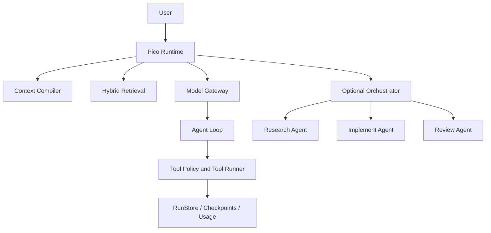

# CodeCub

Local-first Coding Agent Harness.

CodeCub is a local coding-agent runtime for repository work: reading code, compiling context, calling tools with approval boundaries, preserving checkpoints, and optionally coordinating bounded sub-agents for complex tasks. It is designed to run against a local workspace, with runtime state kept under `.codecub/`.

## Overview

CodeCub focuses on the parts of coding-agent systems that are easy to under-specify: context construction, tool safety, replay behavior, local run state, and predictable execution modes. The default path is a single agent. Multi-agent orchestration is available as an explicit opt-in for tasks that naturally split into research, implementation, and review.

## Key Features

- Agent Runtime and agent loop
- Hybrid code retrieval with lexical, AST, optional semantic, and optional reranking signals
- Context engineering with state-preserving compression
- Single-agent default execution and explicit multi-agent mode
- Tool validation, approval policy, and permission boundaries
- Retry, fallback, and circuit breaker support
- Checkpoint and resume support
- Read range freshness guard
- Side-effect replay protection for stable operation identities
- Electron / React / TypeScript desktop shell

## Architecture



## Retrieval

`retrieve_code` combines:

- lexical search through `rg`
- AST-backed symbol lookup
- optional semantic embeddings
- optional reranker
- fast fallback to lexical + AST when semantic services are unavailable

Generated indexes and caches live under `.codecub/index/` and should not be committed.

## Context Engineering

Production defaults:

- State-preserving compression: ON
- Adaptive Hybrid Raw Evidence: OFF
- Hard truncation: retained as fallback

The context compiler keeps recent verbatim evidence, compressed history, working state, token-budget metadata, and freshness / coverage information. Hybrid raw evidence is experimental and requires explicit opt-in through `hybrid_context_enabled = true`.

## Multi-Agent

Single Agent is the default.

Use Multi-Agent explicitly when a task naturally separates into:

- Research
- Implement
- Review

CLI:

```bash
uv run codecub "inspect the failing tests"
uv run codecub "repair the failing tests" --multi-agent
```

Multi-agent mode exposes bounded sub-agent tools. Research and Review remain read-only; Implement is the role that may use modifying tools. Implement is not blindly parallelized.

## Reliability

The runtime keeps tool execution on the same safety path in single-agent and multi-agent modes:

- schema validation
- path safety checks
- approval policy
- result contract validation
- retry and fallback controls
- tool circuit breaker
- checkpoint / resume
- side-effect operation ledger

Side-effect replay protection is scoped to the same run / durable resume path when a stable `operation_key` or native `tool_call_id` exists. It is not a global exactly-once system, does not guarantee cross-process exactly-once behavior, and legacy recovered text tool calls without a stable operation identity have limited replay guarantees.

## Evaluation

Frozen aggregate results from the final evaluation pass:

| Area | Protocol | Result |
| --- | --- | --- |
| Retrieval | N=20 isolated holdout code-location tasks | Pure lexical Top-3 30%; hybrid Top-3 85% |
| Context | N=10 fixed agent tasks | invalid repeated source reads 9 -> 0 |
| Multi-Agent | N=15 serial / parallel comparisons | mean wall-clock 116.33s -> 85.57s (-26.4%); tokens +1.5%; merge failures 0 |
| Reliability | N=10 untouched side-effect scenarios | 10/10 correctness; duplicate commits 0 |

The multi-agent result is a wall-clock scheduling result. It does not claim that multi-agent execution improves task correctness.

## Quick Start

```bash
uv sync
uv run codecub --help
uv run codecub --cwd /path/to/repo "inspect the project"
```

Desktop backend app-mode:

```bash
uv run python -m codecub --app-mode --cwd /path/to/repo
```

## Configuration

OpenAI-compatible provider:

```bash
OPENAI_API_BASE=https://your-api.example/v1
OPENAI_API_KEY=your_api_key_here
OPENAI_MODEL=your_model_here
```

Anthropic-compatible provider:

```bash
ANTHROPIC_API_BASE=https://your-api.example/v1
ANTHROPIC_API_KEY=your_api_key_here
ANTHROPIC_MODEL=your_model_here
```

Execution mode:

```bash
uv run codecub "task"                 # single-agent default
uv run codecub "task" --multi-agent   # explicit multi-agent mode
```

Context flags are runtime feature flags. The production default keeps `context_compiler` enabled and `hybrid_context_enabled` disabled.

## Tests

```bash
uv run pytest -q
uv run ruff check .
git diff --check
```

Desktop:

```bash
cd desktop
npm run typecheck
npm run build
```

## Project Structure

```text
codecub/      Python runtime, tools, retrieval, context, memory, orchestration
desktop/      Electron / React desktop shell
tests/        Python tests
scripts/      Evaluation and packaging scripts
benchmarks/   Benchmark task definitions
assets/       Static screenshots and desktop assets
```

## Limitations

- Multi-agent execution does not guarantee higher correctness.
- Side-effect replay protection is not global exactly-once.
- Cross-process duplicate protection is not currently guaranteed.
- Legacy recovered tool text without a stable operation identity has limited replay protection.
- Generated runtime state under `.codecub/index/`, `.codecub/runs/`, `.codecub/sessions/`, `.codecub/cache/`, and `.codecub/usage/` should not be committed.
