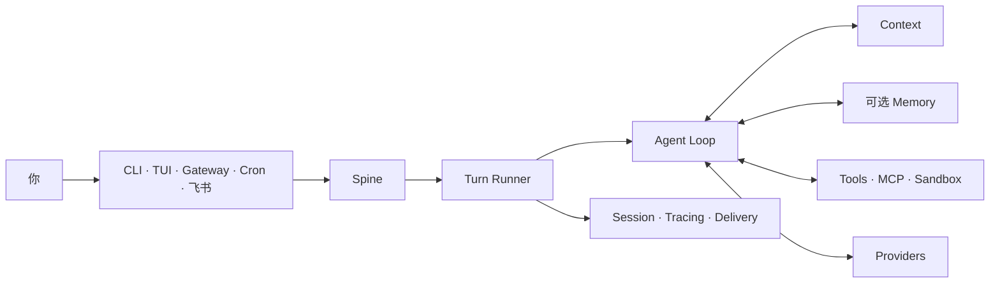

<div align="center">

# Pico

### 一套 Agent Runtime，跟你去每个工作入口。

在终端、原生 TUI、后台 Gateway、定时任务和消息渠道中运行同一个会用工具的 Agent。
入口可以变化，Turn、Session、Context、工具和证据模型保持一致。


[快速开始](#从安装到第一条真实回复) ·
[首次使用指南](docs/onboarding/README.zh-CN.md) ·
[飞书接入](docs/onboarding/feishu.zh-CN.md) ·
[Agent 安装契约](docs/onboarding/agent-install.md) ·
[English](README.md)

</div>

---

Pico 是一套紧凑的 Agent Harness。不同入口不用各自实现 Agent Loop，而是把 Turn
提交给同一套 Runtime。Pico 负责调度、取消、Context 组装、工具执行、Session
持久化、Tracing 和投递。外部 Memory Backend 可以接入这套 Runtime，但当前发布
不包含外部 Memory 实现。



## 从安装到第一条真实回复

Pico 需要 Python 3.12。原生 TUI 使用 Node.js 22；系统缺少合适版本时，安装器
可以配置私有 Node Runtime。

仓库处于 Private 阶段时，先使用已经配置好的 Gitee 凭证克隆，再运行安装器：

```bash
git clone https://gitee.com/htxoffical/pico-harness.git
cd pico-harness
./install.sh
```

Windows PowerShell：

```powershell
git clone https://gitee.com/htxoffical/pico-harness.git
Set-Location pico-harness
.\install.ps1
```

安装器从 Gitee Release 解析 Pico wheel，并默认使用国内 Python 与 Node.js 镜像。
访问 Private Release 时设置 `PICO_GITEE_TOKEN`；需要固定制品时，可以设置
`PICO_WHEEL_URL` 指向经过信任的 wheel。

| 安装控制项 | 用途 |
| --- | --- |
| `PICO_GITEE_TOKEN` | 读取 Private Gitee Release |
| `PICO_WHEEL_URL` | 直接安装经过信任的 Pico wheel |
| `PICO_PYPI_INDEX` | 覆盖 Python 包索引 |
| `PICO_NODE_MIRROR` | 覆盖 Node.js 下载镜像 |
| `PICO_NODE_CHECKSUM_BASE` | 覆盖 Node.js 校验清单来源 |
| `PICO_NPM_REGISTRY` | 覆盖 npm registry |
| `PICO_UV_INSTALL_URL` | 覆盖 uv 安装脚本地址 |

进入希望 Pico 工作的仓库，再完成首次配置：

```bash
cd /path/to/your-project
pico onboard --skip-memory
```

向导按照第一个可验证结果组织为四步：

```text
LLM 凭证 -> 明确关闭 Memory -> 第一条真实 Turn
         -> 运行位置 -> 可选消息渠道
```

当前 Gitee 发布不包含外部 Memory 实现，因此 `--skip-memory` 是受支持的路径。
Pico 会写入 `memory.backend = null`，不会把缺失的 Backend 伪装成健康状态。

向导完成后：

```bash
pico
pico run -m "说明这个仓库的主请求路径"
pico doctor --probe
```

`pico doctor --probe` 会发送一次真实模型请求。静态配置检查通过，或者跳过 probe，
都不能证明 Provider 已经返回回复。

[首次使用指南](docs/onboarding/README.zh-CN.md)包含 Private Release 鉴权、
非交互配置、精确验收命令和常见恢复路径。

## Pico 负责什么

| 你需要什么 | Pico 负责什么 |
| --- | --- |
| 一个 Agent 跨多个入口 | CLI、TUI、Gateway、Cron 和 Channels 提交同一个 Turn 契约 |
| Context 不变成 Prompt 堆积 | 每次模型调用前检索、预算并组装 Context |
| 有明确边界的工具 | Filesystem、Shell、Web、MCP、消息和 Subagent 共用确认与 Sandbox 控制 |
| 可以恢复的对话 | Session 独立于当前终端进程持久化 |
| 可以定位的结果 | Tracing、Provider 用量、投递状态和评测证据分别记录 |
| 人工控制的改进 | Evolver 生成候选和证据，激活与回滚由操作人员明确执行 |

## 接入飞书

Pico 使用飞书 WebSocket 长连接，不需要公网 IP 或 Webhook 域名。

```bash
pico channels enable feishu \
  --app-id "cli_xxxxxxxxxxxxxxxx" \
  --app-secret "$FEISHU_APP_SECRET"

cd /path/to/your-project
pico gateway --workspace "$PWD" --verbose
```

飞书应用仍然需要机器人能力、消息权限、`im.message.receive_v1` 和已发布的应用版本。
发送入站消息前，请先完成[飞书接入指南](docs/onboarding/feishu.zh-CN.md)。配置写入
成功不能证明真实收发链路已经工作。

## 值得记住的命令

| 目标 | 命令 |
| --- | --- |
| 配置 Pico 并执行第一条 Turn | `pico onboard --skip-memory` |
| 打开原生 TUI | `pico` |
| 执行一次 Turn | `pico run -m "..."` |
| 检查 Runtime 与 Provider | `pico doctor --probe` |
| 查看已安装 Plugin | `pico plugins` |
| 管理消息渠道 | `pico channels ...` |
| 服务已启用的渠道 | `pico gateway --workspace /path/to/project` |
| 管理定时任务 | `pico cron ...` |
| 查看 Session 与 Tracing | `pico sessions ...` / `pico tracing` |
| 执行人工受控的演进 | `pico evolve check\|run\|status\|finalize` |

## 状态与安全

| 范围 | 默认位置 |
| --- | --- |
| 全局配置与 Runtime 数据 | `~/.pico` |
| 前台项目 | 当前目录 |
| 前台项目状态 | `~/.pico/projects/<project-id>` |
| Gateway Workspace | 显式传入 `--workspace`，否则使用 `~/.pico/workspace` |

正常启动会把 Pico 状态放在仓库之外。可执行 Plugin 只从 Pico 内置目录、操作人员
管理的 `~/.pico/plugins/` 和已安装的 `pico.plugins` entry point 中发现。
仓库里的 `.pico/plugins/` 不会成为自动启动来源。

修改 Backend 或把安装交给其他操作人员前，请先阅读
[Memory 边界](docs/onboarding/memory.zh-CN.md)和
[故障排查](docs/onboarding/troubleshooting.md)。

## 发布仓库边界

这个仓库保留可发布源码、确定性测试、经过审核的 Benchmark 代码与 Fixture、
安装器、Onboarding 文档和法律文件。开发计划、原始运行数据、真实凭证、私有环境说明
和未发布的外部 Memory 制品不会进入发布仓库。

公开 Benchmark 结果只适用于文档中写明的冻结 Workload 与 Verifier，不能外推为
生产 SLA。评测入口见[评测索引](docs/evaluation/README.md)和
[`benchmarks/`](benchmarks/)。

## 参与贡献

第一次参与 Pico，可以从带有 `good-first-issue` 标签的任务开始。每个可认领任务都会
写明目标分支、相关文件、范围和验收命令；请先在 Issue 下留言认领，再提交一个只处理
该问题的 Pull Request。

完整流程、分支说明和本地验证命令见[贡献指南](CONTRIBUTING.md)。Bug 报告请使用
Gitee Issue 模板，并在公开内容中移除 Token、私钥、内部地址和个人数据。

## 开发与验证

```bash
uv sync --frozen --extra dev --dev
npm ci
npm ci --prefix ui-tui
make check
make picobench-smoke
PICO_RELEASE_OUTPUT=/absolute/empty/output make release-dist
```

Pico 仍处于 pre-1.0，接口可能变化。`make check` 验证保留的发布树，不能替代真实
Provider 或消息渠道的 Smoke Test。

## 许可证

Pico 使用 Apache License 2.0。第三方归属与许可证见 [LICENSE](LICENSE)、
[NOTICES.md](NOTICES.md) 和 [LICENSES/](LICENSES/)。
